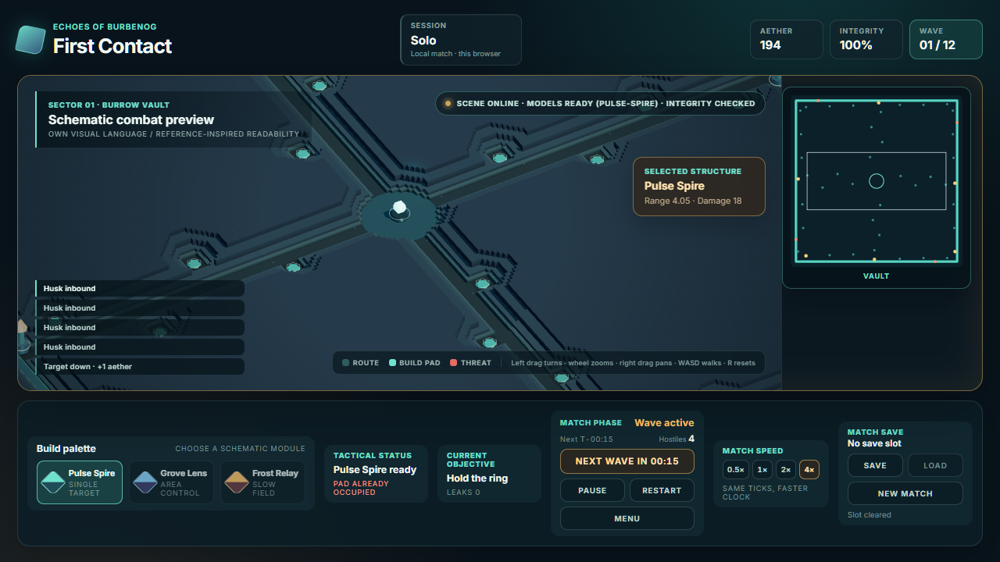
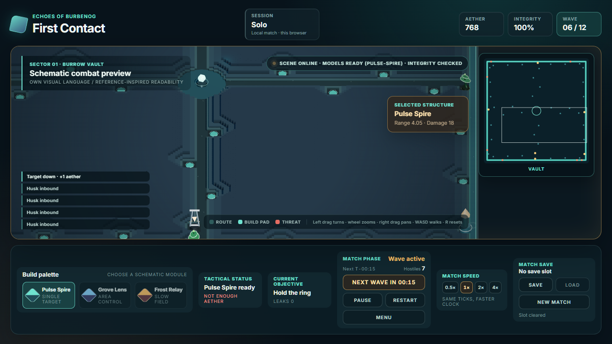
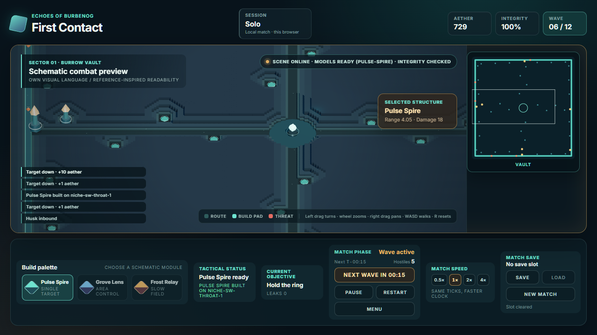
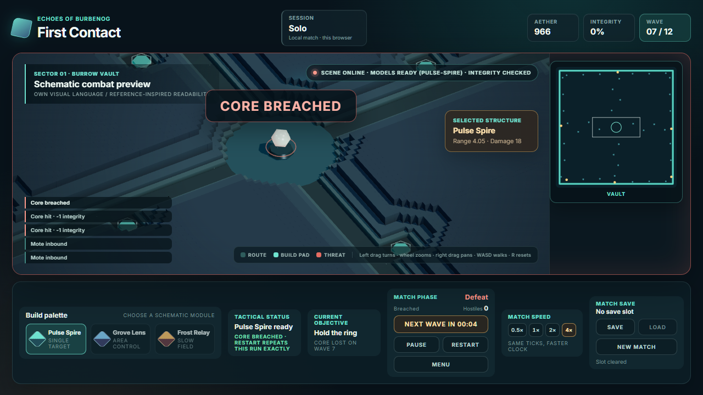

<p align="center">
  
  
  
  
  
</p>

<h1 align="center">Echoes of Burbenog</h1>
<p align="center">LLM-first 3D Tower Defense с постепенным развитием</p>

## Описание

Игра вдохновлена атмосферой и масштабом Warcraft III Tower Defense, особенно референсом Burbenog. Проект строится с нуля: сначала создаётся компактный 3D-ready вертикальный срез, затем расширяются gameplay, графика, сетевые режимы и desktop-сборка.

Ключевая цель разработки — сделать цикл работы максимально удобным для LLM: короткий запуск, детерминированные сценарии, headless-проверки, автоматизированные screenshots и простые границы модулей.

- **3D-ready прототип** — сцена сразу использует XZ-координаты, даже если первый визуальный прототип плоский.
- **LLM-friendly tooling** — Vite, Playwright, structured state и deterministic scenarios.
- **Модульная архитектура** — gameplay, presentation, content и networking развиваются независимо.
- **Solo-first scope** — текущая разработка сфокусирована на одиночной игре; multiplayer остаётся совместимым будущим направлением.
- **Оригинальный visual identity** — собственные модели, арт, палитра и HUD; Burbenog/Warcraft III служат только референсами принципов, а не образцом для копирования.

## Скриншоты

| Карта `burrow-vault` | Середина волны | Рост башни | Поражение | Вход |
|:-:|:-:|:-:|:-:|:-:|
|  |  |  |  |  |
| 96×96, кольцо по периметру, четыре входа из углов, четыре горла к центру, 44 ниши, ядро в центре вне дороги; камера повёрнута на −30° | Пять башен, семь хасков на кольце, миникарта в рельсе справа от дока | Одна башня 6-го уровня и свежая рядом: уровень читается высотой, а не цветом | `Core breached`, ядро 0%, ядро потеряно на седьмой волне из двенадцати | Страница открывается на входе, а не в preparation: решение остаётся за игроком, матч за оверлеем не идёт |

Кадры сняты с production-сборки (`npm run build` плюс статический раздающий сервер), а не копированием
из `test-results/`: на общем каталоге во время съёмки соседние сессии переписывали исходники, и
собранный бандл — единственный способ снять кадр того, что игрок реально получает. Обновляются на
приёмке задачи, меняющей картинку; старые кадры удаляются, а не копятся.

Кадра победы в наборе нет: на момент съёмки добраться до неё не удалось, и подписывать поражение
победой было бы враньём. Всё, что ниже про совпадение по сим, прогнано на поражении.

## Быстрый старт

Реализовано и проверено следующее: карта `burrow-vault` 96×96 (кольцо **по периметру** полуразмером
45, четыре маршрута по шесть точек, круг **360** единиц, дороги **540**, 44 ниши, растр
240×240 = 57 600 клеток), волны, которые **идут сами по таймеру** — двенадцать волн с интервалом 1000
тиков независимо от того, уничтожена ли предыдущая, — и гарантированный доход 90 за волну, 1080 за
матч без единого убийства. Камера свободная: **левым драгом орбита** с наклоном, правый драг —
панорама, колесо — зум от 6.17 до 167.9 пикселей на единицу, WASD, `R` возвращает все три параметра,
миникарта в рельсе справа от дока показывает всю плиту и принимает клик. Скорость игры переключается
0.5× / 1× / 2× / 4× и **не меняет сим**: ускоряется число тиков за кадр, `TICK_RATE` не тронут.

Проверено: `picks` **44 из 44** на всех зумах и азимутах; один и тот же набор из 8 башен на 1× и на 4×
даёт **идентичный терминальный отчёт до тика** (defeat, 8109, золото 866, ядро 0, 164 убийства, 5
зачищенных волн). Матч на разумной раскладке — **12.2–12.7 минуты**. `CONTENT_VERSION` равна 2, старый
слот отвергается с текстом «Save holds content v1 · this build runs v2 · slot left untouched» и
остаётся нетронутым.

**Честно о нерешённом.** Башни и существа — **примитивы из `scripts/build-assets.ts`**, и это главная
причина, по которой игра выглядит черновой. Модели готовятся в соседнем проекте
[`NexusDefense`](https://github.com/AlexanderKuzikov/NexusDefense) и выгружаются под наш контракт
(GLB + манифест, только `Mesh`/`Group`/`SkinnedMesh`/`Bone`, вершинные цвета, наши единицы). Ещё не
решено: монстры не тормозят друг друга на дороге, поэтому сплэш по толпе пока не отличается от сплэша
по одиночной цели (`EOB-45`); башни не растут от опыта убийств; у трёх башен против семи классов врагов
нет выбора тактики; `tests/` — 8 из 48 зелёные, остальные красные и все одного класса (`EOB-038`).

Проверено: `test:assets` — те же 11 красных проверок, артефакт побайтово прежний; E2E: **8 из 48
зелёные, 40 красные**, набор написан под прежнюю карту 22×14 и прежние имена падов. Живых регрессий в
наборе нет, но красный сигнал обесценен, и это `EOB-038`. `test:core` красный на `niche-corner` —
пада нет на карте с `0025`.


```bash
git clone https://github.com/AlexanderKuzikov/Echoes-of-Burbenog.git
cd Echoes-of-Burbenog
npm install
npm run dev
```

Отдельная проверка:

```bash
npx playwright install chromium
npm test
```

Проверка поднимает и Vite, и сервер сессий сама. Для ручной игры вдвоём в одной комнате:

```bash
npm run server   # в соседнем терминале; порт из src/protocol/index.ts
# затем в двух окнах: http://127.0.0.1:5173/?room=<имя-комнаты>
```

Кто вошёл первым, тот и `owner`: у него включены `Restart` и `End room`, у второго (guest) оба выключены с причиной на подсказке. Строить башни и запускать волну может любой, золото у комнаты одно — это сказано в полосе сессии.

Осторожно с двумя вкладками одного браузера: место хранится в `localStorage`, поэтому вторая вкладка, открытая **после** того, как первая вошла в комнату, предъявит тот же токен места и заберёт его себе, а первая получит отказ «a later connection took this seat». Либо открывайте оба окна до входа в комнату, либо играйте во втором окне в режиме инкогнито или в другом браузере. Это плата за то, что личность в v1 — токен места, а не аккаунт.

## Документация

- [`AGENTS.md`](AGENTS.md) — правила работы для AI-агентов.
- [`docs/CONTEXT.md`](docs/CONTEXT.md) — состояние проекта и открытые вопросы.
- [`docs/DECISIONS.md`](docs/DECISIONS.md) — append-only архитектурные решения.
- [`docs/ARCHITECTURE.md`](docs/ARCHITECTURE.md) — целевая архитектура.
- [`docs/PLAN.md`](docs/PLAN.md) — поэтапный план разработки.

## Стек

| Слой | Технология | Статус |
|------|------------|--------|
| Client | TypeScript + Three.js | verified |
| Development | Vite | verified |
| Simulation | TypeScript core | verified |
| QA | Playwright + core check + asset validator | verified |
| Server | Node.js, сессии и комнаты (SSE + POST), dedicated server на Go | verified, заморожен |
| Desktop | Wails + Go | deferred |
| Assets | glTF/GLB, свой генератор, budgets | verified |

## Статус

**v0.2.0-alpha** — карта `burrow-vault` 96×96 и свободная камера с орбитой поверх принятого browser
bootstrap, pure deterministic core, snapshot projection, placement, combat presentation, pause/resume,
seed replay, локальный слот матча, экран входа, двенадцать волн по таймеру и authoritative session на
Node с местами и правами.

**Карта:** 96×96, кольцо **по периметру** полуразмером 45, четыре маршрута
`burrow-north/east/south/west` по шесть точек с `circuit: true`, круг **360.0** единиц, дорог **540**,
ядро в центре вне дороги, 44 ниши, вырезанные из одного растра 0.4 вместе с дорогой. Ниши не равны, и
это единственная валюта позиции: разброс покрытия **10.32×** (12.90 против 1.25) против прежних двух
раз. Покрытие считается по правильной валюте — длина отдельной дороги с дедупликацией по концам
сегментов, а не сумма по четырём маршрутам, где кольцо попадает в сумму четыре раза.

**Волны:** двенадцать, запускаются **по таймеру** с интервалом 1000 тиков независимо от того,
уничтожена ли предыдущая; недобитое копится и уходит дальше само, поэтому задержка на участке
становится минусом на следующем. Гарантированный доход 90 за волну — 1080 за матч без единого
убийства, 47% всего дохода, иначе экономика от убийств плюс копящиеся волны дают спираль. Матч
**12.2–12.7 минуты**.

**Камера:** левый драг — орбита с наклоном (азимут без ограничения, питч 33°…58°), правый драг —
панорама, колесо — зум от 6.17 до 167.9 пикселя на единицу, WASD, `R` возвращает все три параметра.
Миникарта в рельсе справа от дока, вся плита, клик перемещает вид. Регулятор скорости 0.5× / 1× / 2× /
4× ускоряет часы, а не правила: тот же набор башен на 1× и 4× даёт одинаковый матч до тика. Picking
честный, камень перед нишей означает промах, и 44 ниши из 44 доступны на любом зуме и азимуте.

**Честно о нерешённом:** башни и существа — примитивы, это главная причина чернового вида, и модели
готовятся в `NexusDefense`. Монстры не тормозят друг друга, поэтому сплэш по толпе не отличается от
сплэша по одиночной цели (`EOB-45`). Башни не растут от опыта убийств, и золото покупает только новую
башню — это следующая работа. Трёх башен против семи классов врагов не дают выбора тактики: нужен
ротация ростеров с иммунитетами по типам урона и воздухом. «База» пока условность, а не сущность:
свободная расстановка вместо ниш ещё не сделана. E2E-набор привязан к прежней карте и даёт 8 из 48
(`EOB-038`). Лицензия не выбрана, поэтому по умолчанию действует «all rights reserved» (`EOB-008`).


## Лицензия

Лицензия пока не выбрана. Пока её нет, на всё содержимое репозитория действует режим «all rights reserved»: копировать и переиспользовать материалы нельзя. Нельзя копировать и так — ассеты, модели, карты или другие материалы из Warcraft III и Burbenog; проект использует их только как дизайн-референс, а модели и карты делает с нуля.
