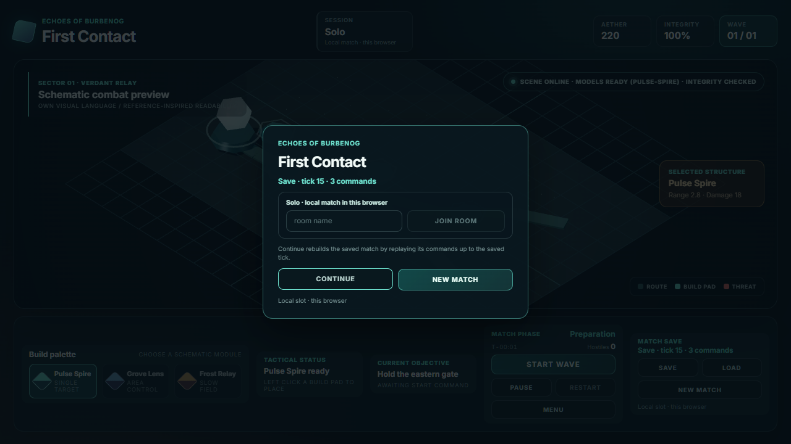
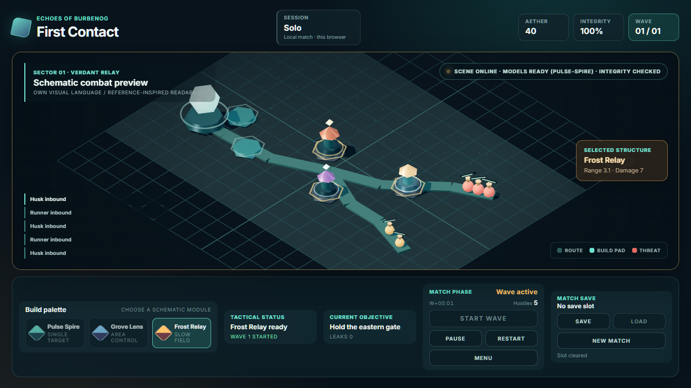
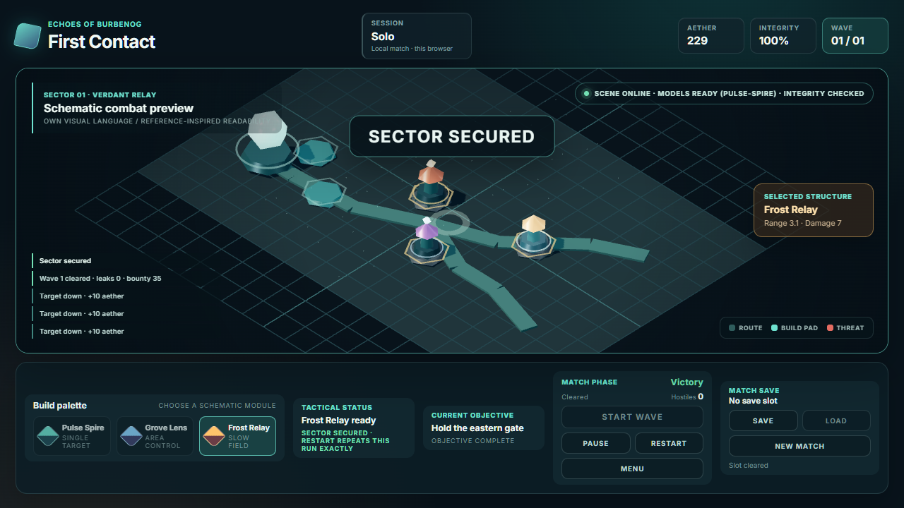
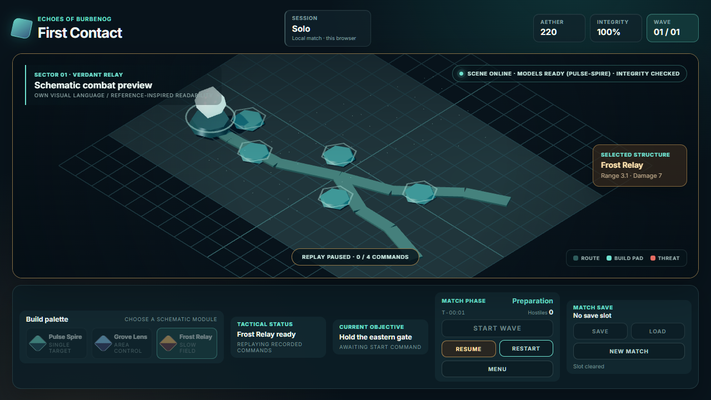
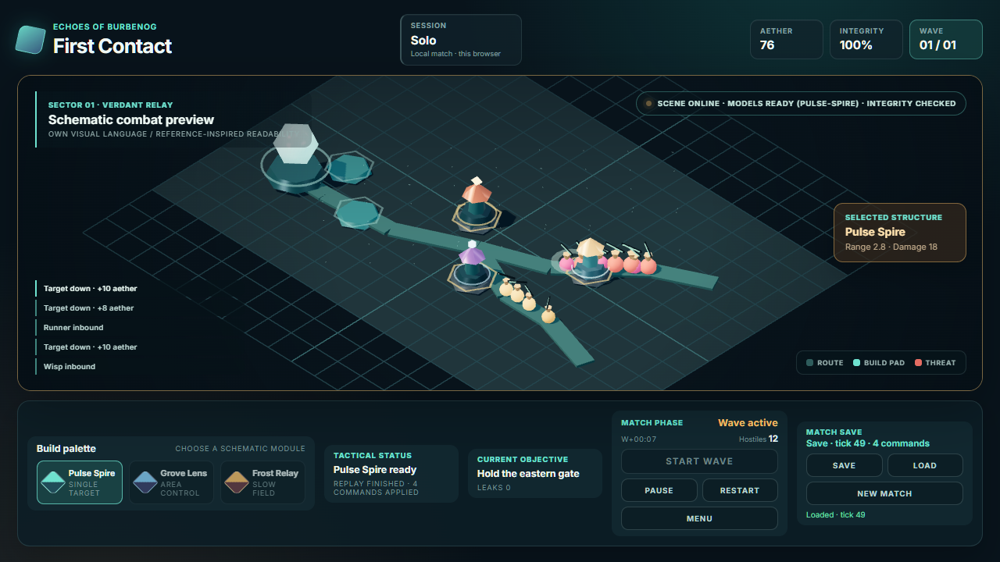

<p align="center">
  
  
  
  
  
</p>

<h1 align="center">Echoes of Burbenog</h1>
<p align="center">LLM-first 3D Tower Defense с постепенным развитием</p>

## Описание

�гра вдохновлена атмосферой и масштабом Warcraft III Tower Defense, особенно референсом Burbenog. Проект строится с нуля: сначала создаётся компактный 3D-ready вертикальный срез, затем расширяются gameplay, графика, сетевые режимы и desktop-сборка.

Ключевая цель разработки — сделать цикл работы максимально удобным для LLM: короткий запуск, детерминированные сценарии, headless-проверки, автоматизированные screenshots и простые границы модулей.

- **3D-ready прототип** — сцена сразу использует XZ-координаты, даже если первый визуальный прототип плоский.
- **LLM-friendly tooling** — Vite, Playwright, structured state и deterministic scenarios.
- **Модульная архитектура** — gameplay, presentation, content и networking развиваются независимо.
- **Solo-first scope** — текущая разработка сфокусирована на одиночной игре; multiplayer остаётся совместимым будущим направлением.
- **Оригинальный visual identity** — собственные модели, арт, палитра и HUD; Burbenog/Warcraft III служат только референсами принципов, а не образцом для копирования.

## Скриншоты

| Вход | Середина волны | Победа | Replay с тем же seed | Восстановление после перезагрузки |
|:-:|:-:|:-:|:-:|:-:|
|  |  |  |  |  |
| Страница открывается на входе, а не в preparation: слот назван тиком и числом команд, решение остаётся за игроком, матч за оверлеем не идёт | Route, build pads, combat log и HUD — проекция `MatchSnapshot` | Terminal state, `Sector secured`, `restart repeats this run exactly` | Тот же матч перезапускается по command log: `REPLAY · 0 / 4 COMMANDS`, палитра и Start Wave заблокированы | Тот же матч после настоящей перезагрузки страницы: слот хранит seed, content, тик и log, а `Continue` пересимулирует его до сохранённого тика |

Остальные состояния РІС…РѕРґР° — `entry-screen-empty.png` (пустой слот, единственное действие), `entry-screen-menu.png` (`MENU` поверх идущего матча), `entry-screen-confirm.png` (подтверждение стирания слота вторым нажатием), `entry-screen-narrow.png` (560 px) Рё `entry-to-victory.png` (полный путь РѕС‚ РІС…РѕРґР° РґРѕ победы). Четыре кадра сессии лежат рядом: `session-room-entry.png` (вход в комнату), `session-room-live.png` (матч в комнате: полоса сессии и пустая панель MATCH SAVE), `session-room-menu.png` (MENU поверх комнаты) и `session-room-narrow.png` (560 px).

Снимки — копии `test-results/`, которые снимает E2E-сьютка. Обновляются на приёмке задачи, меняющей картинку.

## Быстрый старт

Реализовано и проверено следующее: 3D-ready сцена, schematic build pads, placement, combat presentation, pause/resume, replay по seed, локальный слот матча (вход симуляции, а не snapshot; Load — пересимуляция до тика слота), экран входа (Continue из слота или из идущего матча, подтверждение стирания, `MENU` без потери матча), первая authoritative session на Node (комната владеет `Simulation`, транспорт SSE плюс POST без новых зависимостей, версионированный handshake до первого тика, причина отказа команды принадлежит серверу, solo остаётся режимом по умолчанию) плюс asset pipeline: собственная генерация GLB и budgets, per-material IBL, скелетная анимация. Проверено: `test:core`, `test:assets` и 39 зелёных E2E, включая одну комнату на двух настоящих browser context.

```bash
git clone https://github.com/AlexanderKuzikov/Echoes-of-Burbenog.git
cd Echoes-of-Burbenog
npm install
npm run dev
```

Отдельная проверка:

```bash
npx playwright install chromium
npm test
```

Проверка поднимает и Vite, и сервер сессий сама. Для ручной игры вдвоём в одной комнате:

```bash
npm run server   # в соседнем терминале; порт из src/protocol/index.ts
# затем в двух окнах: http://127.0.0.1:5173/?room=<имя-комнаты>
```

## Документация

- [`AGENTS.md`](AGENTS.md) — правила работы для AI-агентов.
- [`docs/CONTEXT.md`](docs/CONTEXT.md) — состояние проекта и открытые вопросы.
- [`docs/DECISIONS.md`](docs/DECISIONS.md) — append-only архитектурные решения.
- [`docs/ARCHITECTURE.md`](docs/ARCHITECTURE.md) — целевая архитектура.
- [`docs/PLAN.md`](docs/PLAN.md) — поэтапный план разработки.

## Стек

| Слой | Технология | Статус |
|------|------------|--------|
| Client | TypeScript + Three.js | verified |
| Development | Vite | verified |
| Simulation | TypeScript core | verified |
| QA | Playwright + core check + asset validator | verified |
| Server | Node.js, сессии и комнаты (SSE + POST), dedicated server на Go | in work |
| Desktop | Wails + Go | deferred |
| Assets | glTF/GLB, свой генератор, budgets | verified |

## Статус

**v0.1.0-alpha** — browser bootstrap, pure deterministic core, snapshot projection, placement, combat presentation, pause/resume, seed replay, локальный слот матча, экран входа (Continue из слота или из идущего матча, подтверждение стирания, `MENU` без потери матча), первая authoritative session на Node: комната владеет `Simulation`, транспорт SSE плюс POST, версионированный handshake, причина отказа команды принадлежит серверу, solo остаётся режимом по умолчанию, а presentation и правила матча — тот же код и тот же core. Плюс asset pipeline: собственная генерация GLB, budgets, per-material IBL и скелетная анимация. Проверено: `test:core`, `test:assets` и 39 зелёных E2E. Следующий шаг фазы 6: `0018` — permissions, reconnect и late join как политика.

## Лицензия

Лицензия пока не выбрана. Пока её нет, на всё содержимое репозитория действует режим «all rights reserved»: копировать и переиспользовать материалы нельзя. Нельзя копировать и так — ассеты, модели, карты или другие материалы из Warcraft III и Burbenog; проект использует их только как дизайн-референс, а модели и карты делает с нуля.
