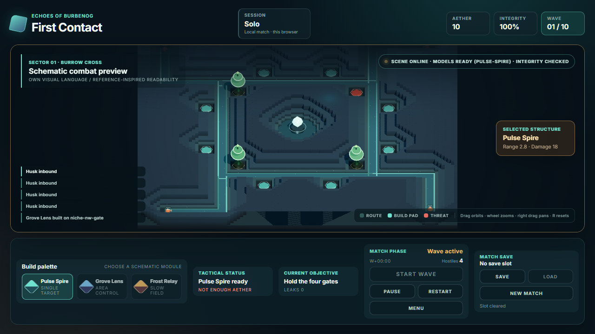
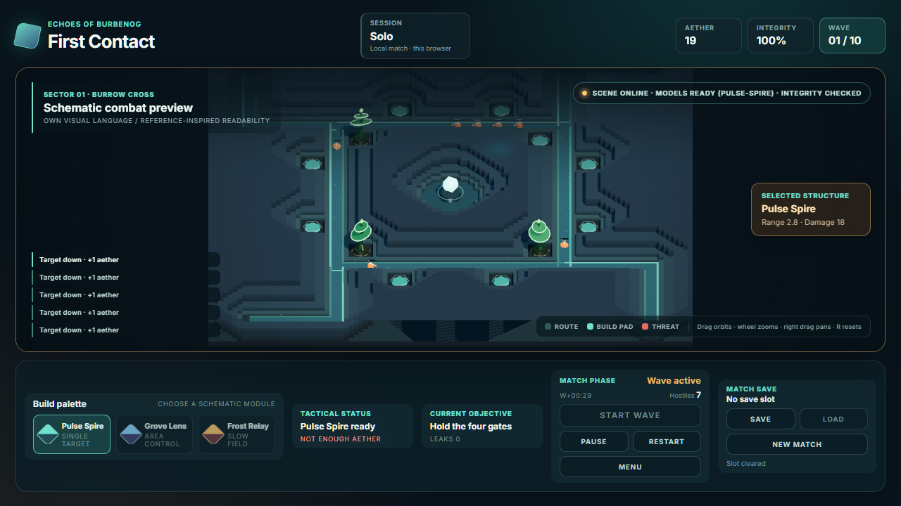
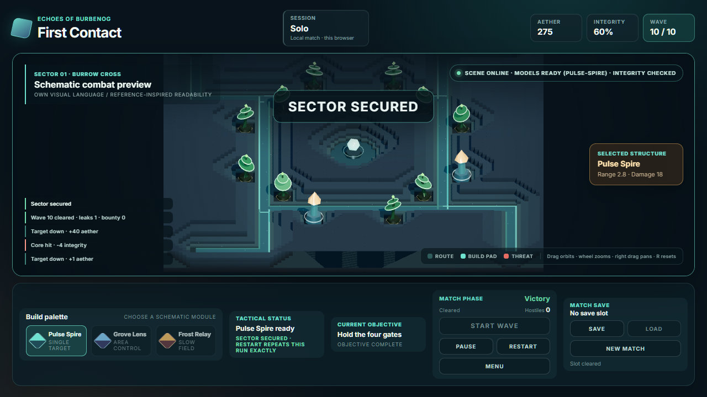
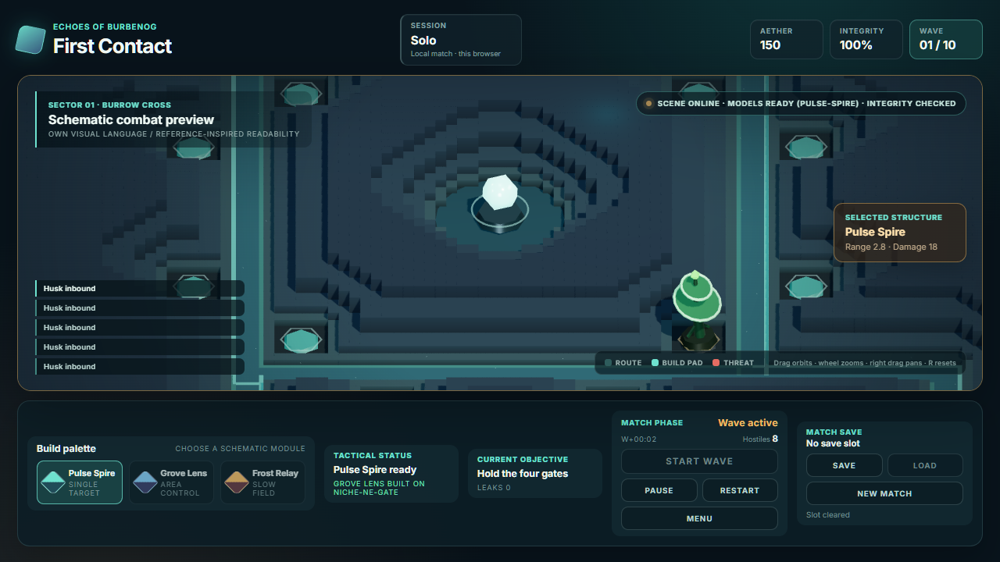
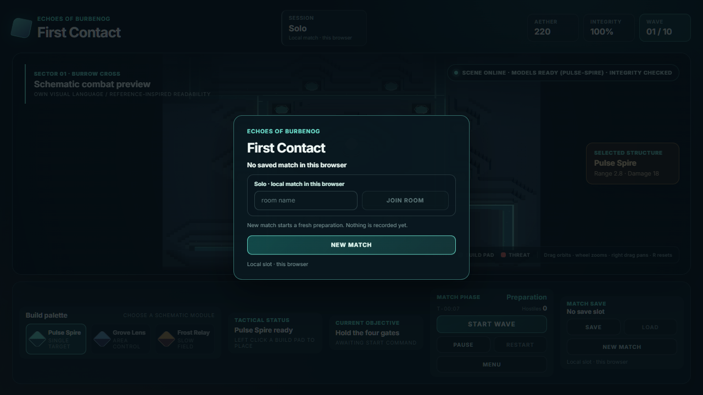

<p align="center">
  
  
  
  
  
</p>

<h1 align="center">Echoes of Burbenog</h1>
<p align="center">LLM-first 3D Tower Defense с постепенным развитием</p>

## Описание

Игра вдохновлена атмосферой и масштабом Warcraft III Tower Defense, особенно референсом Burbenog. Проект строится с нуля: сначала создаётся компактный 3D-ready вертикальный срез, затем расширяются gameplay, графика, сетевые режимы и desktop-сборка.

Ключевая цель разработки — сделать цикл работы максимально удобным для LLM: короткий запуск, детерминированные сценарии, headless-проверки, автоматизированные screenshots и простые границы модулей.

- **3D-ready прототип** — сцена сразу использует XZ-координаты, даже если первый визуальный прототип плоский.
- **LLM-friendly tooling** — Vite, Playwright, structured state и deterministic scenarios.
- **Модульная архитектура** — gameplay, presentation, content и networking развиваются независимо.
- **Solo-first scope** — текущая разработка сфокусирована на одиночной игре; multiplayer остаётся совместимым будущим направлением.
- **Оригинальный visual identity** — собственные модели, арт, палитра и HUD; Burbenog/Warcraft III служат только референсами принципов, а не образцом для копирования.

## Скриншоты

| Карта `burrow-cross` | Середина волны | Победа | Гейтовая ниша | Вход |
|:-:|:-:|:-:|:-:|:-:|
|  |  |  |  |  |
| 40×40, замкнутое кольцо, четыре подвода из четырёх углов, двенадцать ниш по три в квартале, ядро в центре вне дороги | Route, build pads, combat log и HUD — проекция `MatchSnapshot` | `Sector secured`, десять волн, `10 / 10` | Гейт видит 5.28 единицы дороги на дальности Grove Lens против 2.64 у фланка — вдвое, и это лучшее место на карте | Страница открывается на входе, а не в preparation: решение остаётся за игроком, матч за оверлеем не идёт |

Кадры сняты с production-сборки (`npm run build` плюс статический раздающий сервер), а не копированием
из `test-results/`: на общем каталоге во время съёмки соседние сессии переписывали исходники, и
собранный бандл — единственный способ снять кадр того, что игрок реально получает. Обновляются на
приёмке задачи, меняющей картинку; старые кадры удаляются, а не копятся.

## Быстрый старт

Реализовано и проверено следующее: карта `burrow-cross` (40×40, замкнутое кольцо, четыре подвода из
четырёх углов, двенадцать ниш по три в квартале, ядро в центре вне дороги, ценность места — сколько
дороги оттуда видно: гейт 5.28 против 2.64 у фланка) и управляемая камера (драг вращает, колесо зумит,
`R` сбрасывает; клик по нише не проходит сквозь камень). **Известный дефект:** правый драг заявлен в
подсказке как панорама, но не двигает картинку — цель камеры уезжает, а кадр центрируется на коридоре
и гасит сдвиг (`EOB-041`). Дальше: 3D-ready сцена, schematic build pads, placement, combat
presentation, pause/resume, replay по seed, локальный слот матча (вход симуляции, а не snapshot; Load —
пересимуляция до тика слота), экран входа (Continue из слота или из идущего матча, подтверждение
стирания, `MENU` без потери матча), десять волн по семи видам врагов с воздухом с седьмой волны и
боссом на десятой, authoritative session на Node (комната владеет `Simulation`, транспорт SSE плюс POST
без новых зависимостей, версионированный handshake до первого тика, причина отказа принадлежит
серверу, solo остаётся режимом по умолчанию) с местами и правами: токен места вместо аккаунта, роль
`owner`/`guest` от комнаты, `Restart` и `End room` только у owner'а, закрытие комнаты вместо кика,
reconnect как handshake плюс целый кадр без дельт, поздний вход действует сразу при общем aether. Плюс
asset pipeline: собственная генерация GLB и budgets, per-material IBL, скелетная анимация.

Проверено: `test:assets` — те же 11 красных проверок, артефакт побайтово прежний; **E2E: 9 из 48
зелёные, 39 красные, и все 39 одного класса** — набор написан под прежнюю карту 22×14 и прежние имена
падов, 33 из них падают на `pad niche-corner has no screen position`, остальные ждут один маршрут
вместо четырёх, 12 ниш вместо 5 и число объектов 32 вместо 12. Живых регрессий в наборе нет, но
красный сигнал обесценен, и это `EOB-038`. `test:core` красный по той же причине, на `niche-corner`.
Матч прогнан целиком через интерфейс на собранной статике: победа на десятой волне, 17 739 тиков,
14.8 минуты, двенадцать башен, ядро 6/10.

```bash
git clone https://github.com/AlexanderKuzikov/Echoes-of-Burbenog.git
cd Echoes-of-Burbenog
npm install
npm run dev
```

Отдельная проверка:

```bash
npx playwright install chromium
npm test
```

Проверка поднимает и Vite, и сервер сессий сама. Для ручной игры вдвоём в одной комнате:

```bash
npm run server   # в соседнем терминале; порт из src/protocol/index.ts
# затем в двух окнах: http://127.0.0.1:5173/?room=<имя-комнаты>
```

Кто вошёл первым, тот и `owner`: у него включены `Restart` и `End room`, у второго (guest) оба выключены с причиной на подсказке. Строить башни и запускать волну может любой, золото у комнаты одно — это сказано в полосе сессии.

Осторожно с двумя вкладками одного браузера: место хранится в `localStorage`, поэтому вторая вкладка, открытая **после** того, как первая вошла в комнату, предъявит тот же токен места и заберёт его себе, а первая получит отказ «a later connection took this seat». Либо открывайте оба окна до входа в комнату, либо играйте во втором окне в режиме инкогнито или в другом браузере. Это плата за то, что личность в v1 — токен места, а не аккаунт.

## Документация

- [`AGENTS.md`](AGENTS.md) — правила работы для AI-агентов.
- [`docs/CONTEXT.md`](docs/CONTEXT.md) — состояние проекта и открытые вопросы.
- [`docs/DECISIONS.md`](docs/DECISIONS.md) — append-only архитектурные решения.
- [`docs/ARCHITECTURE.md`](docs/ARCHITECTURE.md) — целевая архитектура.
- [`docs/PLAN.md`](docs/PLAN.md) — поэтапный план разработки.

## Стек

| Слой | Технология | Статус |
|------|------------|--------|
| Client | TypeScript + Three.js | verified |
| Development | Vite | verified |
| Simulation | TypeScript core | verified |
| QA | Playwright + core check + asset validator | verified |
| Server | Node.js, сессии и комнаты (SSE + POST), dedicated server на Go | verified, заморожен |
| Desktop | Wails + Go | deferred |
| Assets | glTF/GLB, свой генератор, budgets | verified |

## Статус

**v0.1.0-alpha** — карта `burrow-cross` и управляемая камера поверх принятого browser bootstrap, pure
deterministic core, snapshot projection, placement, combat presentation, pause/resume, seed replay,
локальный слот матча, экран входа, десять волн по семи видам врагов и authoritative session на Node с
местами и правами. **Карта:** 40×40, одно замкнутое кольцо полуразмером 9.4, четыре подвода из
четырёх углов, маршруты `burrow-north/east/south/west` с `circuit: true`, круг 104.0, дорог 132.8,
ядро в центре вне дороги, двенадцать ниш по три в квартале, вырезанных из одного раstra 0.4 вместе с
дорогой. Ниши не равны и гейт — лучшее место на карте: 5.28 единицы дороги на дальности `Grove Lens`
против 2.64 у фланка. **Волны:** десять, состав меняется от хасков к стаям, броне, воздуху с седьмой
волны и боссу `maw` на десятой; враг, обошедший кольцо, начинает круг заново. **Камера:** драг
вращает, колесо зумит, `R` сбрасывает; масштаб при повороте не плывёт, picking честный — камень перед
нишей означает промах. Игровой масштаб 17.19 пикселя на единицу.

**Честно о нерешённом:** панорама камеры не работает, несмотря на подсказку в игре (`EOB-041`).
Механика «пропусти врага и убей на следующем круге» в игре не работает: башня бьёт по прошедшему
дальше всех, поэтому пережить круг не может никто, кроме босса, и ядро платит только боссу (`EOB-042`,
решение за владельцем). E2E-набор привязан к прежней карте и даёт 9 из 48 (`EOB-038`). Длина матча —
10–15 минут в зависимости от сборки башен, а не 8–11. Следующий шаг владельца: экономика с зубами
(золото за волну, чтобы доска не закрывалась раньше середины) и прогрессия башни 1→3 с развилкой.

## Лицензия

Лицензия пока не выбрана. Пока её нет, на всё содержимое репозитория действует режим «all rights reserved»: копировать и переиспользовать материалы нельзя. Нельзя копировать и так — ассеты, модели, карты или другие материалы из Warcraft III и Burbenog; проект использует их только как дизайн-референс, а модели и карты делает с нуля.
